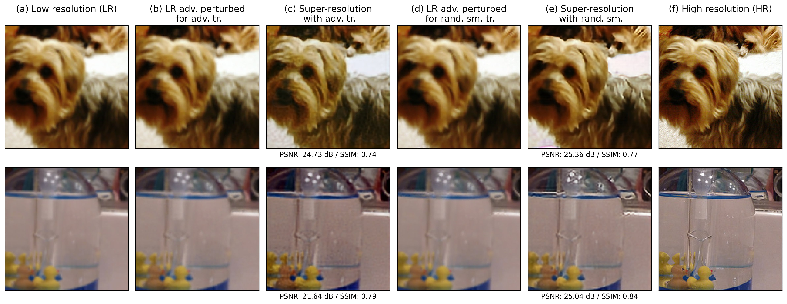
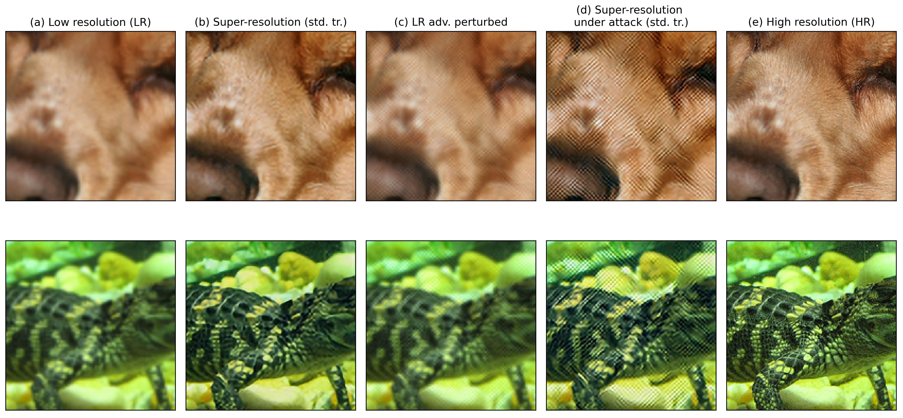
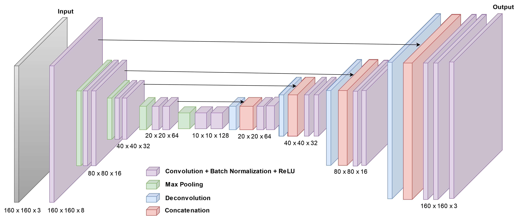
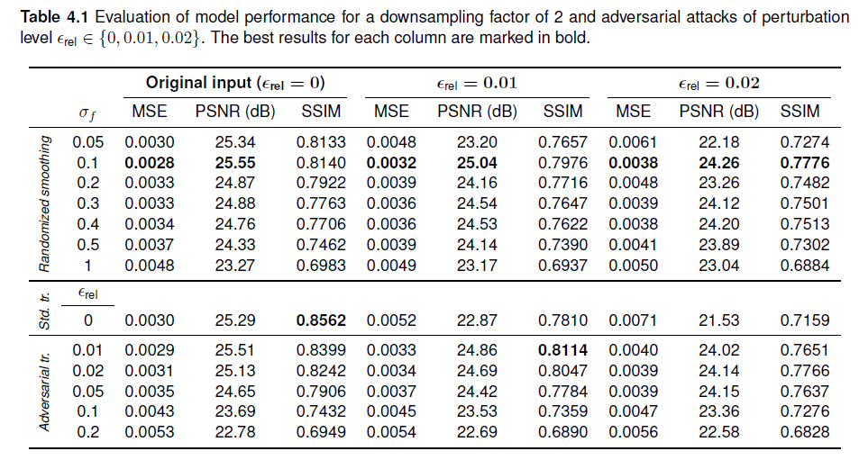

# Randomized Smoothing as an Adversarial Defense Mechanism for Inverse Problems

  
*Example of super-resolution with randomized smoothing vs. with adversarial training, under adversarial attack.*

[](https://opensource.org/licenses/MIT)
[](https://www.python.org/downloads/)
[](https://pytorch.org/)

This repository contains the implementation and experiments for the bachelor's thesis *"Randomized Smoothing as an Adversarial Defense Mechanism for Inverse Problems"* submitted at the Technical University of Munich. The work explores randomized smoothing as a defense against adversarial attacks in image super-resolution and compares it to adversarial training.

## Table of Contents
- [Abstract](#abstract)
- [Introduction](#introduction)
- [Repository Structure](#repository-structure)
- [Background](#background)
- [Experimental Setup](#experimental-setup)
- [Results](#results)

## Abstract
Randomized smoothing is a mechanism that can achieve certifiable robustness of neural network-based
classifiers against $ℓ_2$-norm bounded adversarial examples. In this project, we present an approach to 
randomized smoothing for inverse problems to investigate its effectiveness as an adversarial defense 
mechanism in image reconstruction problems. We choose super-resolution as an image reconstruction problem
to implement randomized smoothing and train U-Net models for super-resolution with different levels of
Gaussian noise for randomized smoothing. We also train U-Net models with adversarial training for a
comparative evaluation of the robustness gains yielded by randomized smoothing in super-resolution. Our
findings show that randomized smoothing is an effective adversarial defense in super-resolution and that
it achieves results with better perceived visual quality than adversarial training.

## Introduction
Deep neural networks for super-resolution are vulnerable to adversarial attacks - subtle input perturbations that cause dramatic output distortions while remaining imperceptible to humans. While empirical defenses like adversarial training exist, they lack theoretical guarantees (especially against unknown attacks) and often degrade output quality. This repository implements **randomized smoothing for super-resolution**. Randomized smoothing offers certifiable robustness within a proven $ℓ_2$-radius.

## Repository Structure

```
randomized-smoothing-adv-sr/
├── data/                              
│   ├── README.md                      
│   └── imagenet-mini/                 
├── models/                            
│   ├── __init__.py
│   └── unet_sr.py                     # U-Net for super-resolution
├── notebooks/                         
│   ├── attacksrs_compare.ipynb        # Comparison of attacks
│   ├── optimize_sigma_smoothing.ipynb # Noise parameter optimization
│   ├── plot_presi.ipynb               # Presentation plots
│   └── visualize.ipynb                # Result visualization
├── paper/                             
│   ├── bachelor_thesis_presentation.pdf
│   └── randomized_smoothing_inverse_problems_thesis.pdf
├── src/                               
│   ├── adv.py                         # Adversarial attack implementation
│   ├── dataset.py                     # Dataset handling
│   ├── evaluate_adv.py                # Adversarial evaluation
│   ├── smoothened_estimate.py         # Randomized smoothing implementation
│   ├── train_adv.py                   # Adversarial training
│   └── train_rs.py                    # Randomized smoothing training
├── .gitignore                         
├── README.md                          
└── requirements.txt                   
```

## Background

### Randomized Smoothing
For classifier f, the smoothed classifier g is:
```math
g(x) = \arg\max_{c \in Q} \mathbb{P}[f(x+\delta) = c], \quad \delta \sim \mathcal{N}(0, \sigma^2 I)
```

### Adaptation to Super-Resolution
For inverse problems, we use:
```math
g(y) = \mathbb{E}_{\delta \sim \mathcal{N}(0, \sigma^2 I)}[f(y+\delta)] \approx \frac{1}{k}\sum_{j=1}^k f(y + \delta_j), \quad \delta \sim \mathcal{N}(0, \sigma^2 I)
```

### Key Properties
- Linear estimators gain no robustness from smoothing
- Training on noisy inputs is crucial for tight bounds
- Noise level σ controls robustness/accuracy trade-off

### Problem Statement
We evaluate randomized smoothing on single-image super-resolution (SISR), an ill-posed inverse problem where:

- Multiple high-resolutions can match one low-resolution input
- Small input changes cause large reconstruction errors
- Robustness is critical for real-world applications



## Experimental Setup

### Dataset
- **Mini-ImageNet-1000** subset
- 34,745 training / 3,923 test images
- 160×160 crops, bilinear downsampling (×2, ×4)

### Model Architecture
**Custom U-Net** with:
- 5 down/up-sampling steps
- Channel sizes: [8,16,32,64,128]
- 3×3 convolutions + ReLU activations

  
*U-Net model architecture visualization*

### Training Methods

#### Randomized Smoothing
1. Train base U-Net on noisy inputs: y + δ, δ ∼ N(0,σ_f²I)
2. Approximate g(y) with k=50 noise samples at test time

#### Adversarial Training
- PGD attacks during training
- Perturbation radius ϵ = √d · ϵ_rel
- 5 attack iterations per batch

### Evaluation Metrics
- **PSNR**: Peak Signal-to-Noise Ratio
- **SSIM**: Structural Similarity Index (better for perceptual quality)
- **MSE**: Mean Squared Error

## Results

### Quantitative Results


*Outputs under up to ϵ_rel=0.02 attack*

### Key Findings
- For small attacks (ϵ_rel ≤ 0.02), randomized smoothing matches adversarial training
- For larger attacks, randomized smoothing achieves better SSIM scores
- Optimal σ_f varies by attack strength (see Appendix in thesis)

## Conclusion
This work demonstrates that:

1. Randomized smoothing can be effectively adapted to inverse problems, such as super-resolution
2. Provides certifiable robustness against ℓ₂ attacks
3. Produces better visual quality than adversarial training
4. Offers flexible robustness-accuracy trade-off via σ_f

Future directions include combining with adversarial training and extending to other inverse problems.
